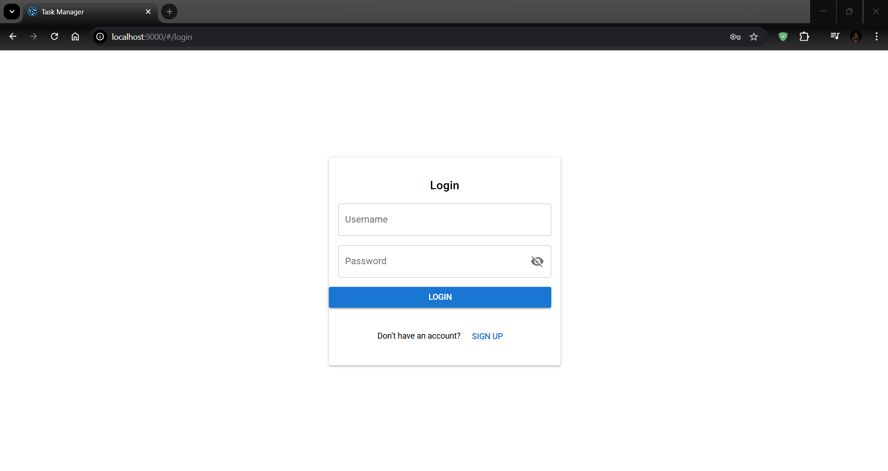
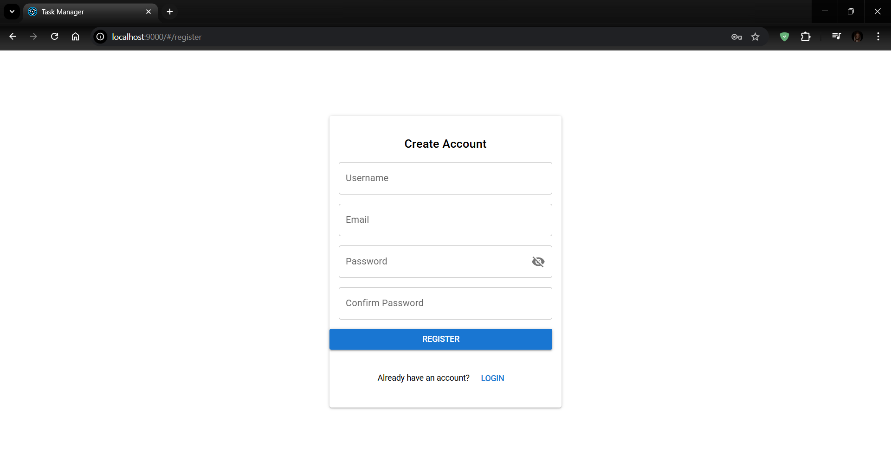
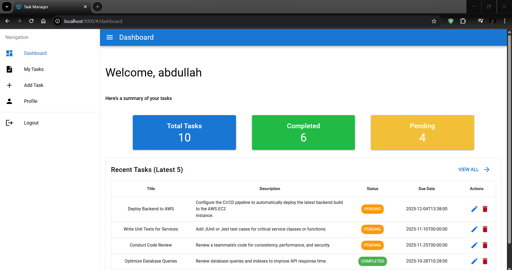
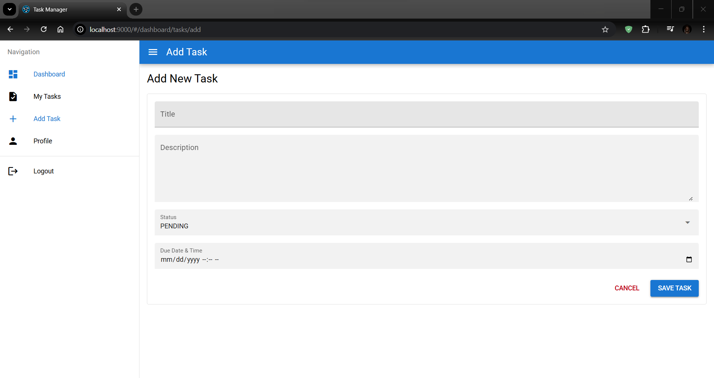
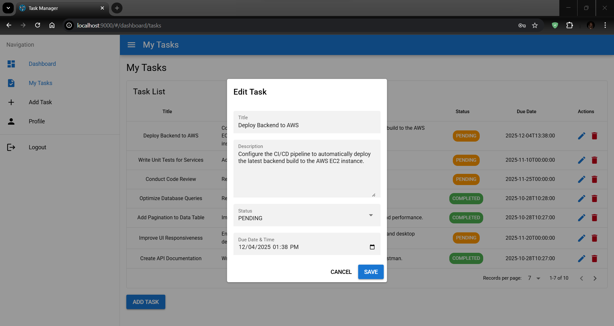
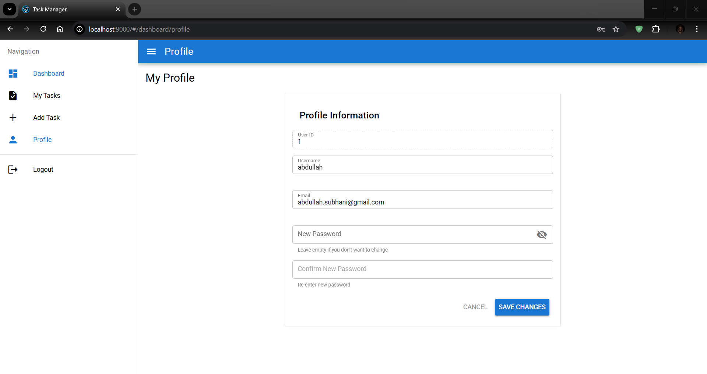

# 📝 Task Manager Application

## 📌 Overview

Task Manager is a **microservices-based application** that allows users to manage their daily tasks with secure authentication.  
The backend is built with **Spring Boot microservices**, while the frontend is built with **Vue.js (Quasar Framework)**.

This repository contains:

* **Backend source code** (`/backend`) + **pre-built JAR files** (`/release-backend`)
* **Frontend source code** (`/frontend`) + **pre-built SPA build** (`/release-frontend`)

👉 You can either run from **source** (for developers) or directly use the **release folders** (for supervisors/testers).

---

## 🏗️ Microservices Architecture

### 🔹 1. Eureka Server (Port: `9092`)

* Service registry where all microservices register.
* Provides centralized discovery and monitoring.

### 🔹 2. Auth Service (Port: `9090`)

* Handles user registration, login, and **JWT-based authentication**.
* Provides **profile management** (update username & password).

### 🔹 3. Task Service (Port: `9094`)

* Manages CRUD operations for tasks:
  * ✅ Create tasks with deadlines
  * ✏️ Update tasks
  * ⏳ Mark tasks as Pending / Completed
  * ❌ Delete tasks

### 🔹 4. Gateway Service (Port: `9093`)

* Acts as a **single entry point** for frontend & backend requests.
* Routes API calls to Auth Service & Task Service.

---

## 🎨 Frontend (Vue + Quasar SPA)

The frontend is a **Single Page Application (SPA)** already built and included in this repo under `/release-frontend`.

### Pages Included:

* 🔑 **Login Page** → User login via JWT  
* 🆕 **Register Page** → New user signup  
* 📊 **Dashboard** → Displays all tasks (Pending / Completed)  
* ➕ **Add Task Page** → Create new tasks with due dates  
* ✏️ **Edit Task Page** → Update tasks or mark as completed  
* 👤 **Profile Management** → Update username & password securely  

---

## 🖼️ Application Screenshots

Below are the main pages of the Task Manager Application.

### 🔑 Login Page
User login screen showing JWT-based authentication.  


### 🆕 Register Page
New user signup form for creating an account.  


### 📊 Dashboard
Displays all tasks (Pending / Completed) for the logged-in user.  


### ➕ Add Task Page
Create new tasks with titles, deadlines, and descriptions.  


### ✏️ Edit Task Page
Update task information or mark tasks as completed.  


### 👤 Profile Management
Manage user account details — update username and password securely.  


---

## ⚙️ Setup Manual

### 1️⃣ Prerequisites

* Install **Java 17+**  
* Install **Node.js (with npm)**

---

### 2️⃣ Run Backend (Spring Boot Microservices)

You have **two options**:

#### 👉 Option A – Run from Release JARs (easiest)

Use the JARs included in `/release-backend`:

```sh
# Step 1 – Start Eureka Server
cd release-backend
java -jar eureka-server.jar

# Step 2 – Start Auth Service
java -jar auth-service.jar

# Step 3 – Start Task Service
java -jar task-service.jar

# Step 4 – Start Gateway Service
java -jar gateway-service.jar
```

📌 Eureka Dashboard → http://localhost:9092  
📌 Gateway (entry point) → http://localhost:9093  

---

#### 👉 Option B – Run from Source Code

If you want to build manually:

⚠️ **Important – Set JWT Secret Key**

Before running from source, you must set a `JWT_SECRET` environment variable on your system.  
This key is required by Auth Service and Gateway Service to generate and validate JWT tokens.

The secret key must follow a base64-encoded string format, similar to:

```
Example: AbCdEfGhIjKlMnOpQrStUvWxYz1234567890+/=
```

You can create your own secret but make sure it keeps the same pattern.

Once created, set it as an environment variable:

**For Windows (PowerShell):**
```bash
setx JWT_SECRET "your_base64_encoded_secret_here"
```

**For macOS/Linux:**
```bash
export JWT_SECRET="your_base64_encoded_secret_here"
```

💡 In IntelliJ IDEA, you can also define this variable under:  
`Run → Edit Configurations → Environment Variables`  
and set `JWT_SECRET` there for both **auth-service** and **gateway-service**.

Now build and run each service:

```sh
cd backend/eureka-server
mvn clean package -DskipTests
java -jar target/eureka-server-0.0.1-SNAPSHOT.jar

cd backend/auth-service
mvn clean package -DskipTests
java -jar target/auth-service-0.0.1-SNAPSHOT.jar

cd backend/task-service
mvn clean package -DskipTests
java -jar target/task-service-0.0.1-SNAPSHOT.jar

cd backend/gateway-service
mvn clean package -DskipTests
java -jar target/gateway-service-0.0.1-SNAPSHOT.jar
```

---

### 3️⃣ Run Frontend

You also have two options:

#### 👉 Option A – Run from Release Build (recommended)

Use the already-built `/release-frontend` folder:

```sh
cd release-frontend
npx serve .
```

📌 Access → http://localhost:3000  

---

#### 👉 Option B – Run from Source Code

If you want to modify the frontend:

```sh
cd frontend
npm install
quasar dev
```

---

## ✅ Project Flow

1️⃣ Start **Eureka Server (9092)**  
2️⃣ Start **Auth Service (9090)**  
3️⃣ Start **Task Service (9094)**  
4️⃣ Start **Gateway Service (9093)**  
5️⃣ Run frontend with `npx serve .` inside `/release-frontend` → open `http://localhost:3000`

---

## 🚀 Features Recap

* 🔐 **Secure Authentication (JWT)**  
* 📋 **Task Management (Add, Edit, Delete, Pending/Completed)**  
* ⚡ **Microservices-based Architecture**  
* 🌐 **API Gateway with centralized routing**  
* 🎨 **SPA frontend ready-to-serve (no build required)**
